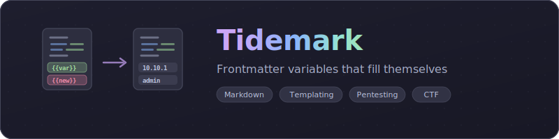

<div align="center">

<picture>
  <source media="(prefers-color-scheme: dark)" srcset="assets/banner.svg">
  <source media="(prefers-color-scheme: light)" srcset="assets/banner.svg">
  
</picture>

<br>

**Replace variables in markdown with YAML frontmatter values on demand**

[](LICENSE)
[](https://obsidian.md)
[](https://www.typescriptlang.org)

<br>

Define variables in YAML frontmatter, reference them with `{{variable}}` syntax anywhere in your document, then copy or replace with a single command. Perfect for pentesting workflows, CTF notes, and reusable note templates.

</div>

<br>

## Table of Contents

- [Highlights](#highlights)
- [Quick Start](#quick-start)
- [Variable Syntax](#variable-syntax)
- [Commands](#commands)
- [Configuration](#configuration)
- [Use Cases](#use-cases)
- [Syntax Highlighting](#syntax-highlighting)
- [Tips & Tricks](#tips--tricks)
- [Troubleshooting](#troubleshooting)

---

## Highlights

<table>
<tr>
<td width="50%">

### Variable Replacement
Replace `{{variables}}` with YAML frontmatter values on demand. Copy to clipboard or permanently replace in-document. Supports nested properties, arrays, and default values.

</td>
<td width="50%">

### Quick Copy
Copy current line, selection, or entire document with variables replaced directly to clipboard. Paste commands straight into your terminal with values already filled in.

</td>
</tr>
<tr>
<td width="50%">

### Syntax Highlighting
Color-coded variables in the editor: green for existing values, orange for variables with defaults, red for missing. See variable status at a glance without running anything.

</td>
<td width="50%">

### Variable List & Context Menu
Use List All Variables to see every variable grouped by status, edit values, and navigate to locations. Right-click any variable to set its value directly.

</td>
</tr>
<tr>
<td width="50%">

### Nested Properties
Access nested YAML with dot notation: `{{server.ip}}`, `{{credentials.user}}`. Array indexing with `{{items[0]}}`. Toggle nesting on or off per your workflow.

</td>
<td width="50%">

### Flexible Configuration
Custom delimiters, default values, case-insensitive matching, array join separators, missing value text, notification levels. Every aspect is configurable through Obsidian settings.

</td>
</tr>
</table>

---

## Quick Start

### 1. Install the Plugin

**From Community Plugins:**
1. Open Obsidian Settings > Community Plugins
2. Click "Browse" and search for "Tidemark"
3. Click Install, then Enable

**Manual Installation:**
1. Download `main.js`, `manifest.json`, and `styles.css` from the [latest release](https://github.com/real-fruit-snacks/tidemark/releases)
2. Create a folder `.obsidian/plugins/tidemark/` in your vault
3. Copy the three files into that folder
4. Enable the plugin in Settings > Community Plugins

### 2. Set Up Your Note

```markdown
---
IPAddress: 10.10.10.1
hostname: target
username: admin
ports: 22,80,443
---

# Enumeration

nmap -A -p- {{IPAddress}}
gobuster dir -u http://{{IPAddress}} -w /usr/share/wordlists/dirb/common.txt
ssh {{username}}@{{hostname}}
```

### 3. Use Commands

Open the Command Palette (Ctrl/Cmd+P) and type "Tidemark" to see all available commands. Configure hotkeys in Settings > Hotkeys.

---

## Variable Syntax

### Basic Variable

```
{{variableName}}
```

### Variable with Default Value

```
{{port:1-1000}}
{{username:root}}
{{protocol:https}}
```

### Nested Properties (Dot Notation)

```markdown
---
target:
  ip: 10.10.10.1
  port: 8080
credentials:
  user: admin
---

curl http://{{target.ip}}:{{target.port}}
ssh {{credentials.user}}@{{target.ip}}
```

### Array Handling

```markdown
---
ports:
  - 22
  - 80
  - 443
---

Open ports: {{ports}}
# Result: Open ports: 22, 80, 443
```

---

## Commands

Access via Command Palette (Ctrl/Cmd+P), then type "Tidemark":

| Command | Description |
|---------|-------------|
| **Copy current line (replaced)** | Copy line to clipboard with variables replaced |
| **Copy selection (replaced)** | Copy selected text with variables replaced |
| **Copy document (replaced)** | Copy entire document with variables replaced |
| **Replace in selection** | Permanently replace variables in selection |
| **Replace all in document** | Replace all variables in document body |
| **Replace in document and filename** | Replace in document and rename file |
| **Rename file (replace variables)** | Rename file with variables replaced |
| **List all variables** | View and edit all variables |
| **Set variable value** | Set/edit variable at cursor position |

Configure keyboard shortcuts in Obsidian Settings > Hotkeys > search "Tidemark".

---

## Configuration

Access via Settings > Community Plugins > Tidemark:

### Delimiters

| Setting | Default | Description |
|---------|---------|-------------|
| `openDelimiter` | `{{` | Characters marking variable start |
| `closeDelimiter` | `}}` | Characters marking variable end |
| `defaultSeparator` | `:` | Separator for default values (`{{var:default}}`) |

### Behavior

| Setting | Default | Description |
|---------|---------|-------------|
| `missingValueText` | `[MISSING]` | Text when variable not found |
| `supportNestedProperties` | `true` | Enable dot notation for nested properties |
| `caseInsensitive` | `false` | Match variables regardless of case |
| `arrayJoinSeparator` | `, ` | Characters used to join array values |
| `preserveOriginalOnMissing` | `false` | Keep `{{var}}` if not found instead of replacing |
| `notificationLevel` | `all` | `all`, `errors`, or `none` |

### Visual

| Setting | Default | Description |
|---------|---------|-------------|
| `highlightVariables` | `true` | Color-code variables in editor |
| `highlightColors.exists` | auto | Color for set variables (hex, e.g. `#28a745`) |
| `highlightColors.missing` | auto | Color for missing variables |
| `highlightColors.hasDefault` | auto | Color for variables with defaults |

---

## Use Cases

### Pentesting Workflow

Create template notes for different target types:

```markdown
---
IPAddress:
hostname:
---

# Recon Commands
nmap -sV -sC {{IPAddress}}
nikto -h {{IPAddress}}
gobuster dir -u http://{{IPAddress}} -w /path/to/wordlist

# Quick Shell
nc {{IPAddress}} {{port:4444}}
```

**Workflow:**
1. Duplicate template for each target
2. Fill in frontmatter values
3. Use **Copy current line (replaced)** to copy commands with values filled
4. Paste directly into terminal

### CTF Notes

```markdown
---
challenge: Web Exploitation 101
flag: CTF{not_found_yet}
url: http://ctf.example.com
---

# {{challenge}}

Target: {{url}}
Flag: {{flag}}

# Commands
curl {{url}}/robots.txt
sqlmap -u "{{url}}/login" --batch
```

### Project Templates

```markdown
---
project: My New Project
author: {{author:Anonymous}}
date: {{date:TBD}}
repo: {{repo:github.com/user/repo}}
---

# {{project}}

**Author:** {{author}}
**Date:** {{date}}
**Repository:** {{repo}}
```

---

## Syntax Highlighting

Variables are automatically color-coded in your editor:

| Color | Status | Meaning |
|-------|--------|---------|
| Green | Exists | Variable has a value in frontmatter |
| Orange | Has Default | Variable not set but has a default value |
| Red | Missing | No value and no default |

Colors adapt to light/dark themes automatically (Catppuccin Latte/Mocha). Override with custom hex values in settings.

---

## Tips & Tricks

### Quick Command Execution

1. Write command templates in your note
2. Position cursor on command line
3. Use "Copy current line (replaced)" from the command palette
4. Paste in terminal
5. Execute

### Bulk Updates

Use **List all variables** to:
- See all variables at once
- Quickly identify missing values
- Edit multiple values in sequence

### Template Management

1. Create a "templates" folder in your vault
2. Build reusable note templates
3. Duplicate when starting new notes
4. Fill in unique values via frontmatter

### Default Values Strategy

Use default values for common scenarios:

```
{{port:443}}
{{protocol:https}}
{{method:GET}}
{{timeout:30}}
```

---

## Troubleshooting

| Problem | Solution |
|---------|----------|
| Variables not highlighting | Ensure "Highlight Variables" is enabled in plugin settings |
| Variables not replacing | Check spelling (or enable case-insensitive); validate YAML syntax |
| Commands not showing | Ensure plugin is enabled; check Command Palette for "Tidemark" |
| Nested properties not resolving | Verify "Support Nested Properties" is enabled in settings |

---

<div align="center">

**Built for offense. Tested in labs.**

[GitHub](https://github.com/real-fruit-snacks/tidemark) | [License (MIT)](LICENSE) | [Report Issue](https://github.com/real-fruit-snacks/tidemark/issues)

*Tidemark — templates that fill themselves*

</div>
